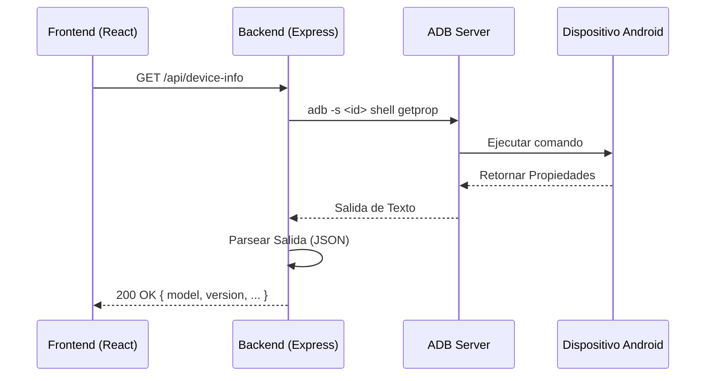

# Arquitectura del Sistema - Android Diagnostic Platform

Este documento detalla las decisiones técnicas, patrones de diseño y flujos de datos de la plataforma.

## 📋 Tabla de Contenidos
- [Visión General](#visión-general)
- [Componentes del Sistema](#componentes-del-sistema)
- [Flujo de Datos de ADB](#flujo-de-datos-de-adb)
- [Manejo de Procesos](#manejo-de-procesos)
- [Seguridad](#seguridad)

---

## 🔍 Visión General

La plataforma está diseñada para ser un puente entre una interfaz web moderna y las herramientas de bajo nivel de Android (`ADB` y `Fastboot`). El backend actúa como un orquestador que traduce peticiones HTTP en comandos de sistema o llamadas a la librería `adbkit`.

---

## 🏗️ Componentes del Sistema

### 1. Frontend (React + Vite)
- **Estado Global:** Manejado mediante hooks de React.
- **Interfaz HUD:** Utiliza `Tailwind CSS` para el diseño y `Framer Motion` para animaciones de alta fidelidad.
- **Visualización:** `Recharts` procesa los datos de telemetría recibidos del backend.

### 2. Backend (Node.js + Express)
- **API REST:** Expone endpoints para todas las funcionalidades del dispositivo.
- **ADB Bridge:** Utiliza una combinación de `adbkit` para operaciones de alto nivel y `child_process` para comandos nativos complejos.
- **Streaming:** Implementa Server-Sent Events (SSE) o polling para actualizaciones en tiempo real (ej. Logcat).

---

## 🔄 Flujo de Datos de ADB

El backend gestiona la comunicación con los dispositivos de la siguiente manera:

---

## ⚙️ Manejo de Procesos

Para operaciones de larga duración (como grabación de pantalla o flasheo), el backend utiliza `spawn` de `child_process`.

> ⚠️ **Nota Crítica:** El backend debe gestionar correctamente la terminación de estos procesos para evitar procesos "zombie" en el sistema host.

### Ejemplo de Flujo de Grabación:
1. El usuario inicia la grabación desde la UI.
2. El backend ejecuta `adb shell screenrecord`.
3. El proceso se mantiene activo hasta que el usuario envía una señal de parada.
4. El backend finaliza el proceso y descarga el archivo resultante.

---

## 🛡️ Seguridad

- **CORS:** Configurado para permitir peticiones solo desde el origen del frontend.
- **Validación de Inputs:** Los comandos enviados a `adb shell` son sanitizados para evitar inyecciones de comandos en el sistema host.
- **Permisos:** La plataforma requiere que el dispositivo tenga habilitada la "Depuración USB" y, para ciertas funciones, acceso Root.

---
*Documento generado para Android Diagnostic Platform V3.0.*
