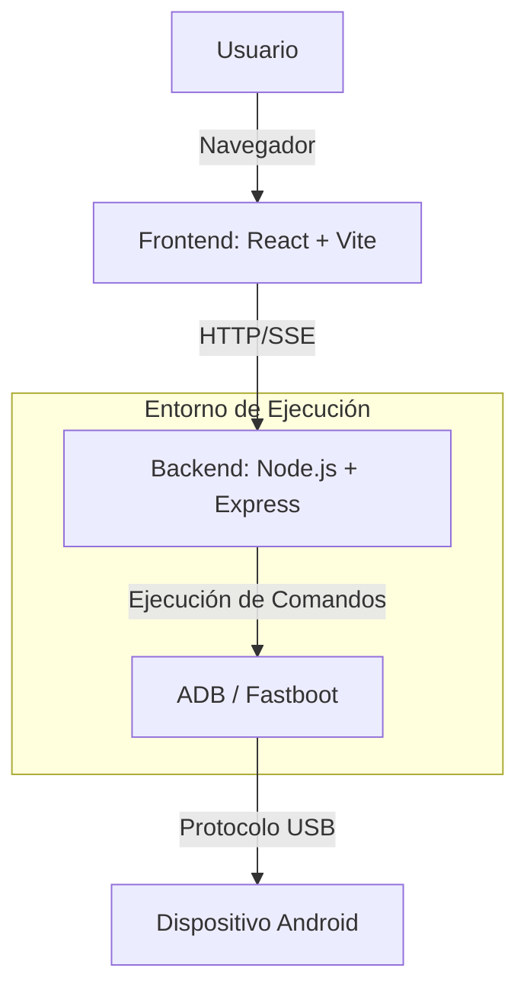

# Android Diagnostic Platform V3.0 (TECH HUD)

Plataforma avanzada de diagnóstico, control remoto y análisis forense para dispositivos Android, diseñada con una interfaz moderna tipo "Scifi HUD".

## 📋 Tabla de Contenidos
- [Resumen Ejecutivo](#resumen-ejecutivo)
- [Arquitectura de Alto Nivel](#arquitectura-de-alto-nivel)
- [Características Principales](#características-principales)
- [Stack Tecnológico](#stack-tecnológico)
- [Guía de Inicio Rápido](#guía-de-inicio-rápido)
- [Documentación Técnica](#documentación-técnica)

---

## 🚀 Resumen Ejecutivo

**Android Diagnostic Platform V3.0** es una herramienta integral diseñada para desarrolladores, técnicos forenses y entusiastas que requieren un control profundo sobre dispositivos Android.

*   **Problema:** La fragmentación de herramientas de diagnóstico y la complejidad de interactuar con dispositivos Android a bajo nivel.
*   **Solución:** Una interfaz web unificada que abstrae comandos complejos de `ADB` y `Fastboot` en acciones simples, permitiendo telemetría en tiempo real y control total.
*   **Impacto:** Reducción drástica en el tiempo de diagnóstico, automatización de tareas repetitivas y visualización clara de datos críticos del sistema.

---

## 🏗️ Arquitectura de Alto Nivel

La plataforma sigue una arquitectura cliente-servidor donde el backend actúa como un puente seguro entre la interfaz web y el dispositivo físico.



---

## 🔥 Características Principales

*   **Diagnóstico Avanzado:** Telemetría en tiempo real (batería, sensores, CPU, RAM).
*   **Control Remoto:** Input events, capturas de pantalla y grabación de pantalla.
*   **Gestión de Aplicaciones:** Instalación, desinstalación y gestión de paquetes.
*   **Seguridad y Forense:** Extracción de logs (Logcat), auditoría de seguridad y herramientas de recuperación.
*   **Asistente Root:** Automatización de parcheo de imágenes de booteo (AutoPatch).

---

## 🛠️ Stack Tecnológico

| Capa | Tecnologías |
| :--- | :--- |
| **Frontend** | React, Vite, Tailwind CSS, Framer Motion, Recharts, Lucide React |
| **Backend** | Node.js, Express, Axios, adbkit |
| **Core** | ADB (Android Debug Bridge), Fastboot |

---

## ⚡ Guía de Inicio Rápido

### Prerrequisitos
- Node.js (v18+)
- Android SDK Platform-Tools instalado y en el PATH.

### Instalación y Ejecución
1. **Clonar el repositorio:**
   ```bash
   git clone <url-del-repositorio>
   cd AndroidDiagnostic
   ```

2. **Instalar dependencias:**
   ```bash
   # Backend
   cd Backend && npm install
   # Frontend
   cd ../Frontend && npm install
   ```

3. **Ejecutar:**
   Utiliza el script proporcionado:
   ```bash
   ./Run_servers.command
   ```

---

## 📚 Documentación Técnica

Para detalles técnicos profundos, consulta:
- [`ARCHITECTURE.md`](ARCHITECTURE.md): Detalles de la implementación y flujo de datos.
- [`API_REFERENCE.md`](API_REFERENCE.md): Referencia completa de los endpoints del backend.

---
*Hecho con tecnología ADB, Fastboot y automatización para diagnósticos técnicos avanzados e ingenieros forenses.*
